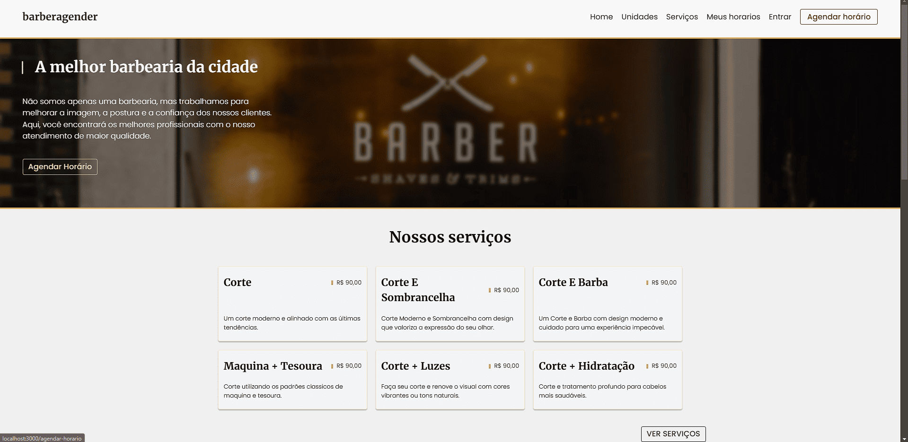
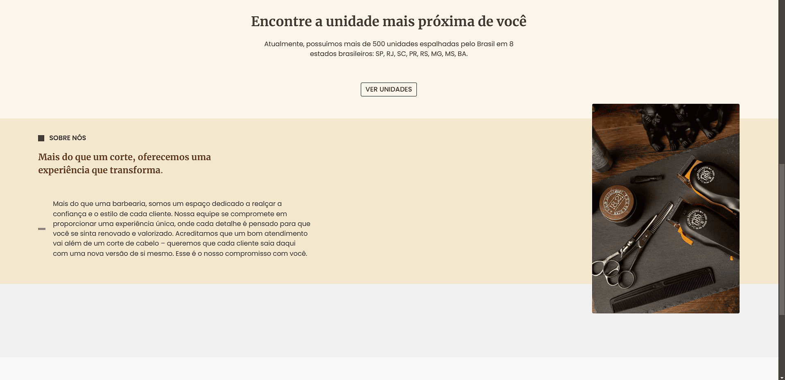
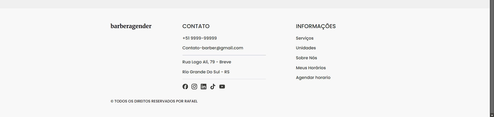
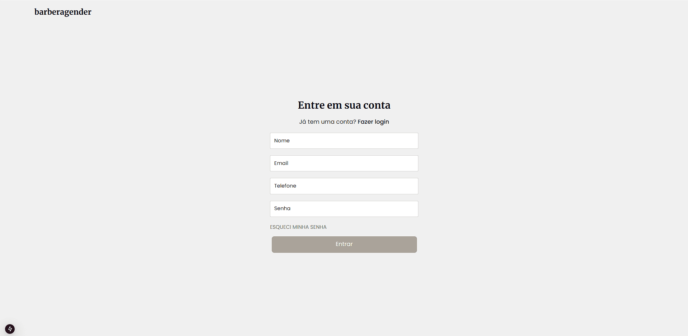
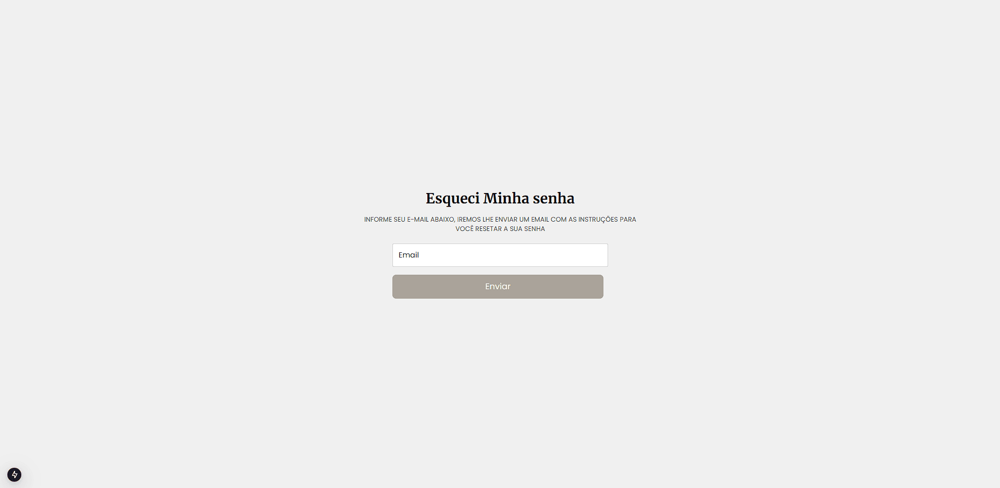
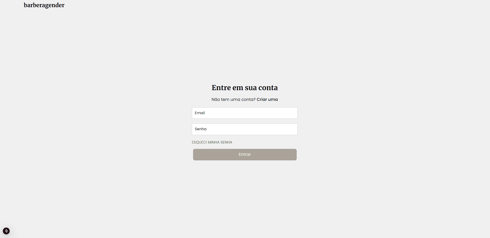
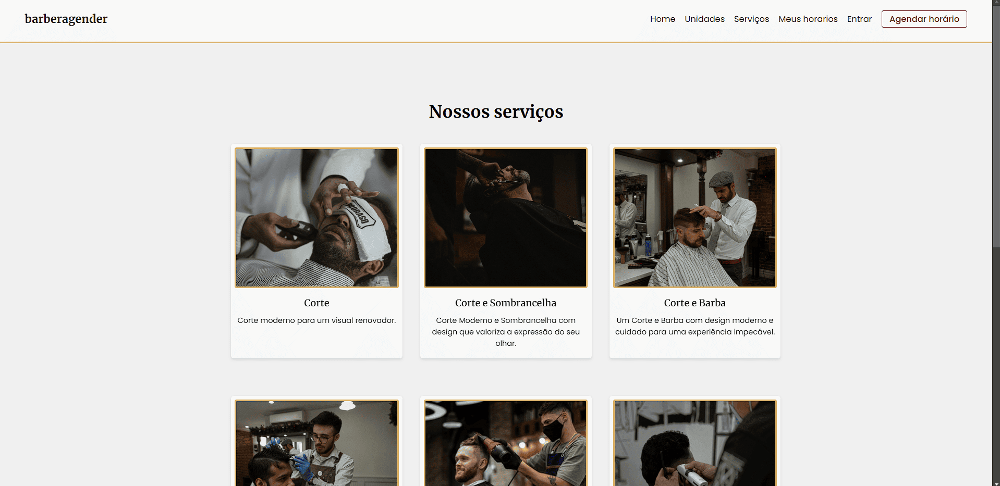
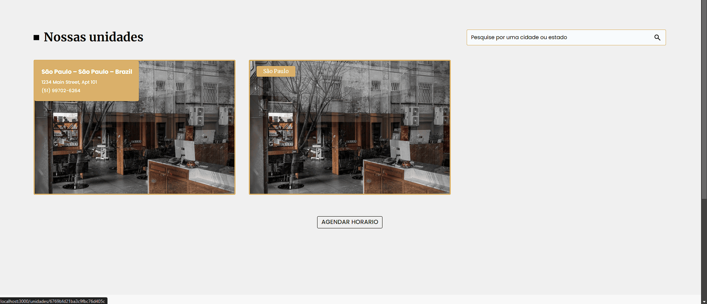
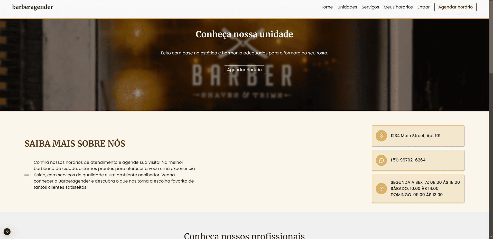
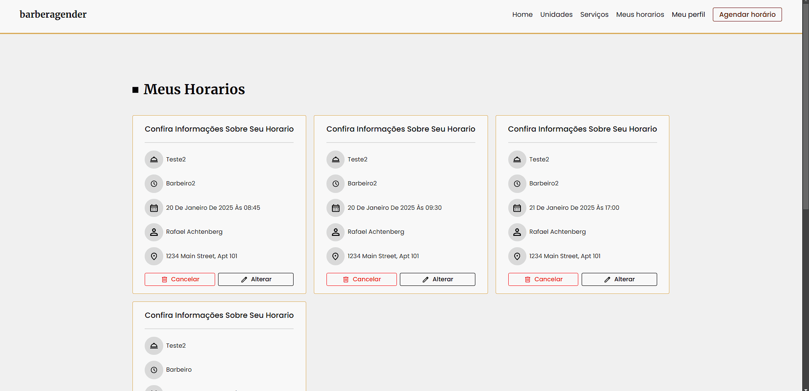

# Barber-Fe

Uma aplicação front-end para uma barbearia, desenvolvida com um layout intuitivo e moderno. O projeto apresenta informações essenciais sobre a barbearia, incluindo localização, unidades, serviços, equipe de barbeiros, redes sociais e formas de contato.
Com um sistema de autenticação integrado, tanto barbeiros quanto clientes podem gerenciar agendamentos de forma prática e eficiente.

## 🚀 Tecnologias Utilizadas

💻 **Front-end**

- [Next-js](https://nextjs.org/docs/pages/building-your-application/configuring/environment-variables)
- [React](https://react.dev/)
- [Typescript](https://www.typescriptlang.org)

📚 **Bibliotecas**

- [jose](https://www.npmjs.com/package/jose) - Utilizado para manipulação de tokens JWT.
- [date-fns](https://www.npmjs.com/package/date-fns) - Biblioteca para manipulação de datas.
- [clsx](https://www.npmjs.com/package/clsx)- Facilita a concatenação de classes CSS.
- [react-hook-form](https://react-hook-form.com/) Gerenciamento de formulários.
- [react-hot-toast](https://react-hot-toast.com/) Exibição de notificações.
- [radix-ui](https://www.radix-ui.com/) Componentes acessíveis e estilizados.
- [zod](https://zod.dev/) Validação de dados com TypeScript.

🎨 **Estilização**

- [tailwindcss](https://tailwindcss.com/docs/installation): Framework de estilização utilitária.

🔋 **Versionamento e Deploy**

- [Git](https://git-scm.com) Controle de versão.

## 📷 Layout

 
 

⚙️ **Configuranções e Instalações**

Clone do Projeto

    $ git clone https://github.com/Faelkk/my-portfolio

Instalando as dependências

    $ npm install

Iniciando o projeto

    $ npm run dev

 

**Como me ajudar nesse projeto?**

- Você ira me ajudar muito me seguindo aqui no GitHub
- Dando uma estrela no projeto
- Conectando-se comigo no LinkedIn para fazer parte da minha rede.

 

**📝 Autor**

Se gostou, não esqueça de deixar uma estrela! 🚀

[Rafael Achtenberg](linkedin.com/in/rafael-achtenberg-7a4b12284/)
